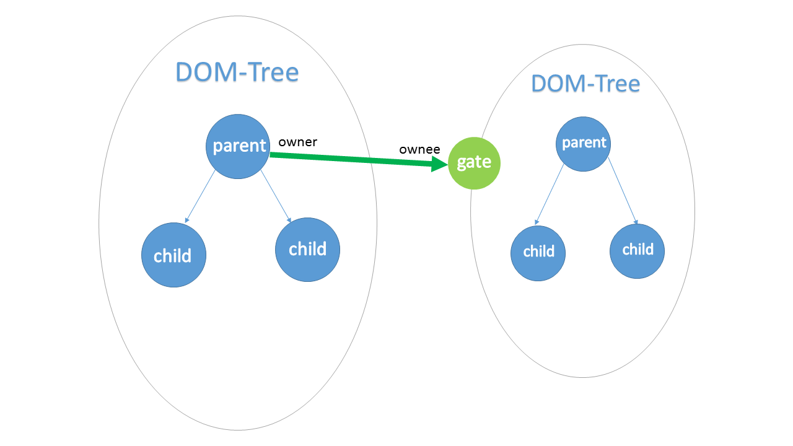

#Introduction
This is a tool designed to bundle CommonJs packages to run in browsers. However, in short, what I focus on is a problem about custom element of HTML. Plus, because it builds in Nodejs, it supports module coding natively. In other words, you can build packages for Nodejs and for browsers as well.
##"puppet" means what

